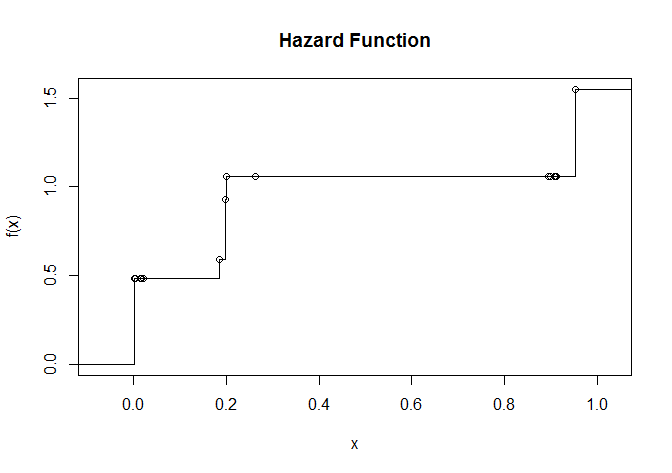
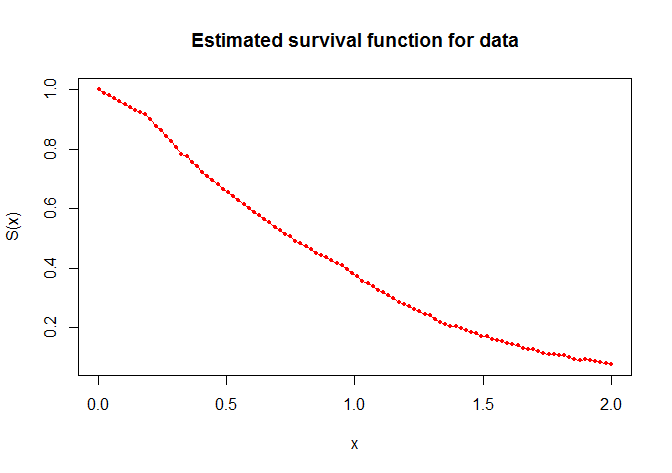

# iHaz
The `iHaz` is the accompanying package for the paper on estimation of montone hazards for left truncated and interval censored data. The papers introduces a novel approach which estimates the hazrd (and consequently survival function) for left truncated and interval censored data uder the assumption of monotone hazards. We build upon the work of Pan et al. (1998) which uses a projection algorithm and integrate ideas from the support reduction algorithm of Groeneboom et al. (2008). 

#####References
Pan, Wei, and R. Chappell. "Estimating survival curves with left-truncated and interval-censored data under monotone hazards." Biometrics (1998): 1053-1060.

Piet Groeneboom, Geurt Jongbloed, and Jon A. Wellner. "The Support Reduction Algorithm for Computing Non-Parametric Function Estimates in Mixture Models." Scandinavian Journal of Statistics 35.3 (2008): 385-399.
#####Requirements
- `R (>=3.1.0)`
- `Rcpp (>=0.12.0)`
- `RcppArmadillo`


-------------------------------------------------------------------------

##Example Code

* The main function takes as input an object of type `list` or `data.frame` with 3 components. 
  1. `t` the left truncation time.
  2. `a` the lower limit of the censoring interval.
  3. `b` the upper limit of the censoring interval. This can be `Inf` to denote right censoring.
```R
library(iHaz)
#Here event to time is distributed as Exponential(1)
#Simulation study from Pan et al. (1998)
set.seed(1)
n<- 500
x<- rexp(n)
t<- runif(n, min = 0, max = 1.5)
xnew<- x[(x>=t)]
tnew<- t[x>=t]
t<- tnew
a<- xnew
b<- xnew
a[xnew<= tnew+0.5]<- tnew[xnew<= tnew+0.5]
b[xnew<= tnew+0.5]<- tnew[xnew<= tnew+0.5] +0.5
a[xnew > tnew+0.5]<- tnew[xnew > tnew+0.5] +0.5
b[xnew > tnew+0.5]<- Inf
dat<- list("a" = a, "b" = b, "t" = t)
```

* In theory the parmeter can be as large as the total number of unique time points in our data. In practice the estimated hazard is a step function with few change points. This motivates the use of the support reduction algorithm. The algorithm requires only an initial index vector corresponding to the time points which correspond to the set of change points for the estimated hazard. 
```R
fit<- iHaz(dat, ini.index = 1:3 ,verbose =TRUE)
```

* The main function returns 2 R functions which can take vector inputs for the estimated hazard and survival functions, respectively. 
```R
#A step function for the Hazard
> fit$hazard
Step function
Call: stepfun(z[myans$index], c(0, myans$lam))
 x[1:16] = 0.001972, 0.0024634, 0.0030288,  ..., 0.91277, 0.95365
17 plateau levels =      0, 0.48359, 0.48359,  ..., 1.0596, 1.5492

>plot(fit$hazard, main = "Hazard Function")
```


*The `S3` plot functions for objects of call `iHaz` plots the hazard and survival functions for the range of the data.
```R
plot(fit, col = "red", type = "o", lwd = 1, pch = 16, cex = 0.5)
```



-------------------------------------------------------------------------
##Installation
* From Github: `devtools::install_github("asadharis/iHaz")` latest development version.

NOTE: The `R` package will be uploaded to `CRAN` soon upon approval by PI.

-------------------------------------------------------------------------
##Acknowledgements 
I would like to express my deep gratitude to Professor Gary Chan, my research supervisor, for his patient guidance, enthusiastic encouragement and useful critiques of this project.
